# **Effective Targeting of Advertisments**
Work with the advertising data of a marketing agency to develop a machine learning algorithm that predicts if a particular user will click on an advertisement.

Target : Clicked on Ad

         1 = Yes, clicked on Ad 
         0 = No, did not click on Ad
         
Number of Total Features in Dataset : 9

## **Cleaning Data**
- Evaluated data types and null counts
  - It was determined that six columns ['Age', 'Area Income', 'City', 'Country', 'Daily Time Spent on Site', 'Daily Internet Usage'] included null values. 
   
   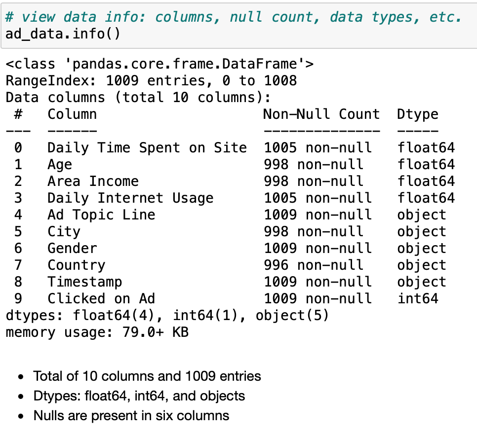
    
    To correct this issue, null values were filled with the median value. However, both 'City' and 'Country' null values were dropped from the dataset due to the concerns of keeping integrity of the data. 
   
## **Data Exploration**

### Correlation Matrix utilizing Seaborn 

  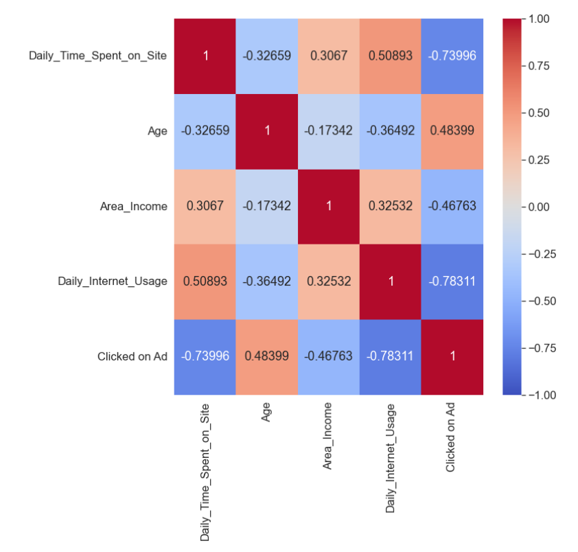

### Age Demographics 

  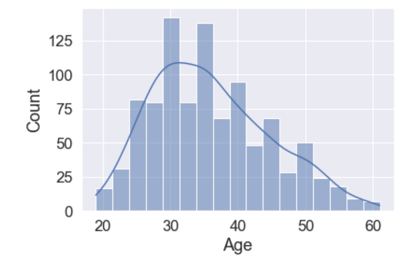

### Internet Usage & Age

  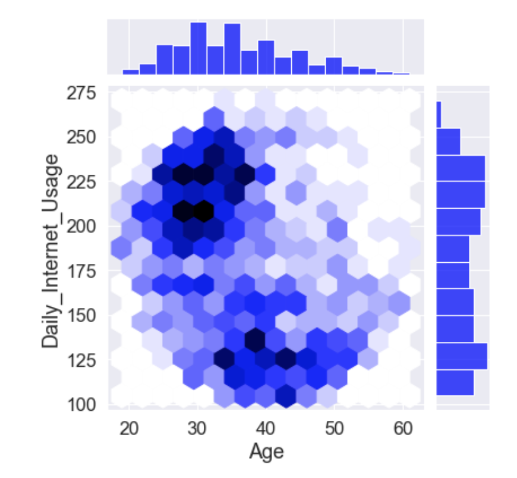
  
### Advertisment Pattern by Month

### Advertisment Pattern by Month and Hour

### Relation between All Features

  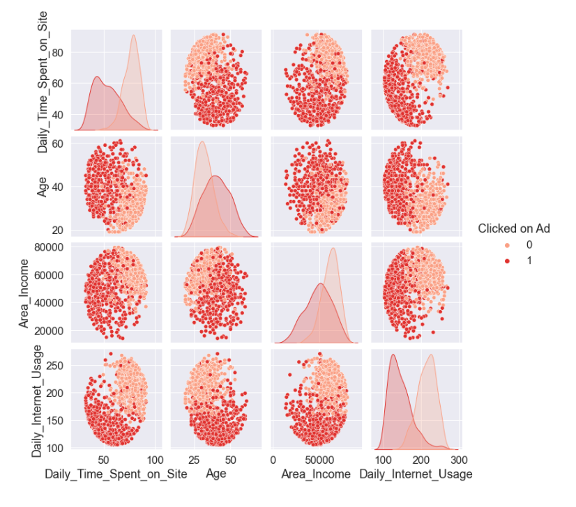
    
### Imbalances
- Before moving foward, it was necessary to check for any imbalances of the data. 
  - 499 (Clicked on Ad) / 486 (Did not Click on Ad)
  - No drastic difference to cause data imbalances
       
### Feature Selection 
- Checked for unique values in City, Country, and Ad Topic columns. 
  - Looking at the table below, it is evident that there are abundant unique values in all three features. Thus, it will be increasingly difficult to find a pattern from these three features. As a result, utilizing other variables for prediciton is necessary. 
       
       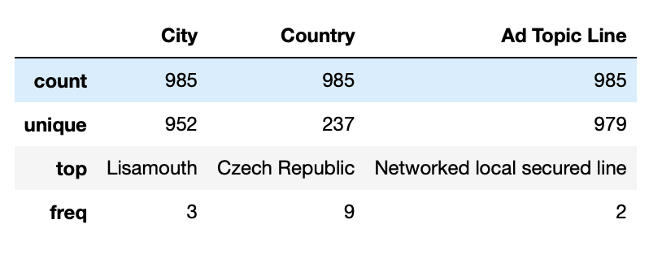

- Evaluated Time Stamp column 
   - Extracted month and hour from Time Stamp column and dropped original column. This will allow to view month by month differences and times of traffic. 
  
### Label Encoding
- Utilized LabelEncoder for Gender Column. 
  - 0: Female, 1:Male

### Correlation with **Clean** Data 

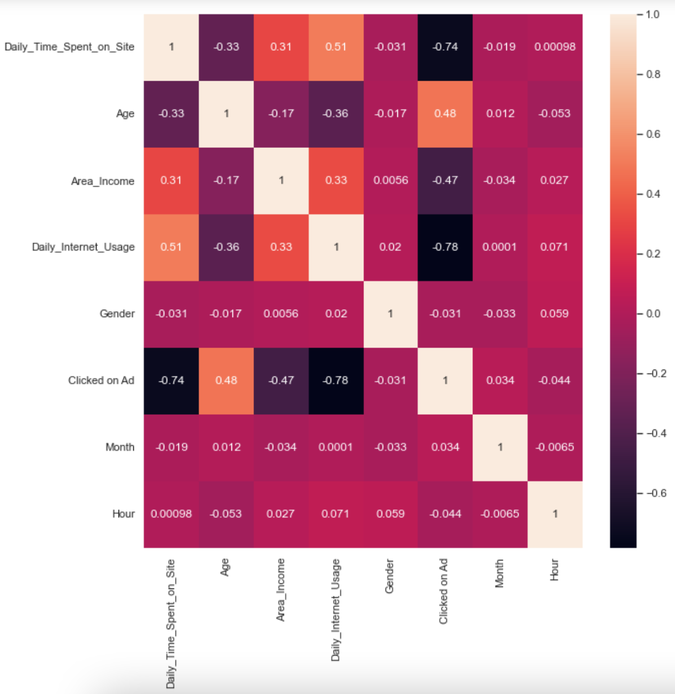

### Relation between all Variables 

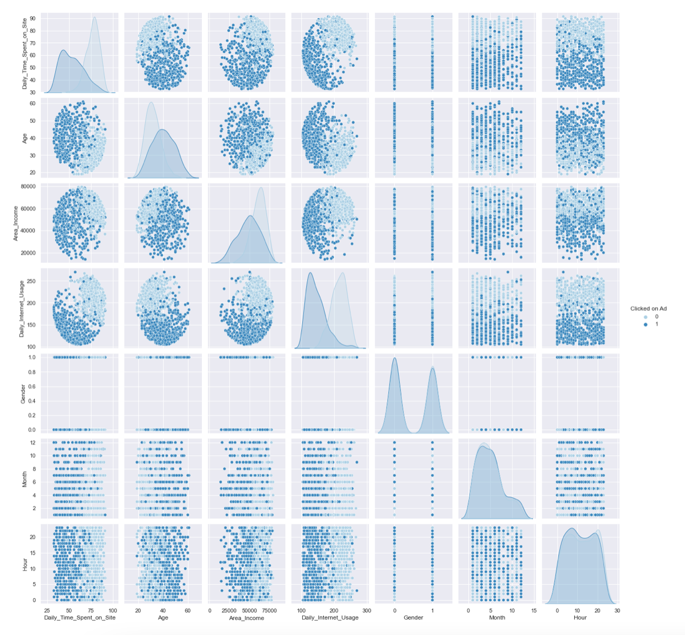

## Models 
It is vital to bring to light that the dataset is within the bounds of Classification. The goal is for the classification model is to predict whether the target ('Clicked on Ad') is either 1 (clicked on) or 0 (not clicked on).

The following models will be implemented
  1) Logistic Regression
  2) Decision Tree Classifier

## **Decision Tree Classifier**

- Train Size = 70%
- Test Size = 30%

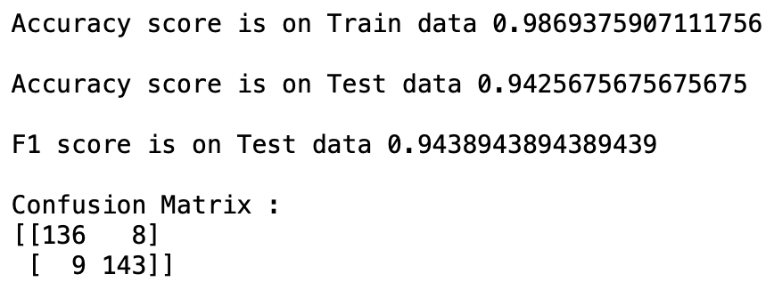

## **Logistic Regression**

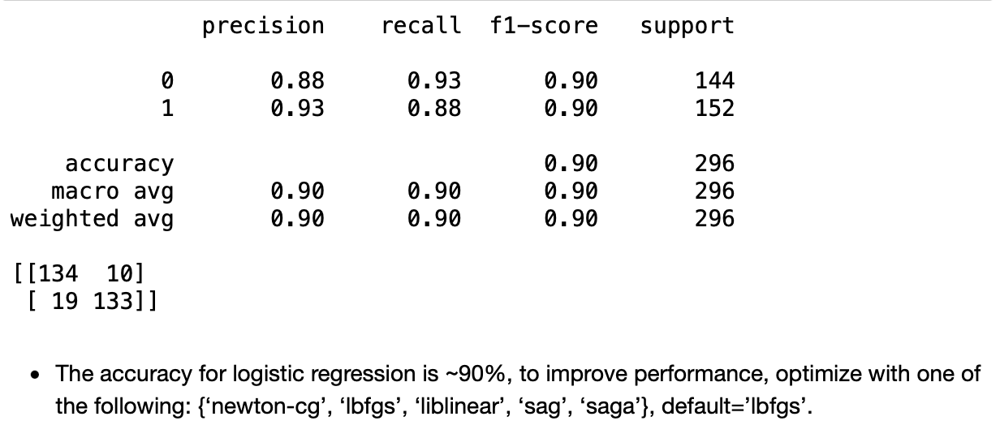

## Optimized Logistic Regression

- Implemented four different solvers to imporove accuracy score:
 - liblinear =  89.86%
 - lbfgs = 90.20%
 - sag/saga = 48.65%
 - newton_cg = 94.59% 
 
- Due to the increased perfromance of solver, newton_cg, accuracy rose about 4-5%. As a result, newton_cg solver was chosen for optimization. Some experts argue, Newton’s method uses in a sense a better quadratic function minimisation. However, the newton_cg solver is also computationally expensive due to the Hessian Matrix. This concern would be of greater concern when dealing with larger datasets. 
 
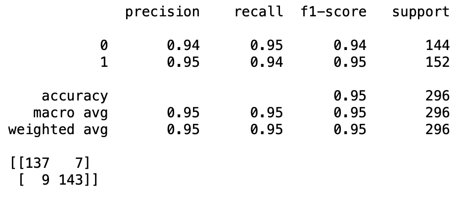

## Final Conclusions 

Overall Model Scores:
1) Decision Tree Classifier Model: MoA = 93.75%
2) Logistic Regression Model: MoA = 90.20%
3) Optimized Logistic Regression Model : MoA = 94.59%

The best model to use for Effective Advertising is the Optomized Logistic Regression Model that utilizes the newton_cg solver. 
