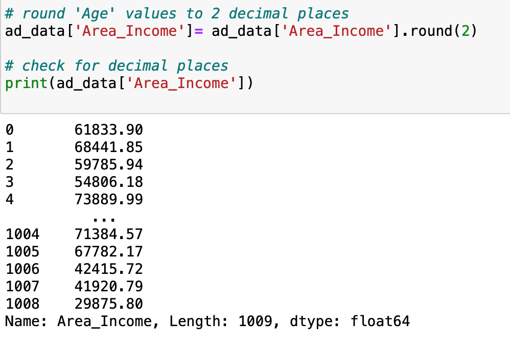

# **Effective Targeting of Advertisments**
Work with the advertising data of a marketing agency to develop a machine learning algorithm that predicts if a particular user will click on an advertisement.

Target : Clicked on Ad

         1 = Yes, clicked on Ad 
         0 = No, did not click on Ad
         
Number of Total Features in Dataset : 9

## **Cleaning Data**
- Evaluated data types and null counts
  - It was determined that six columns ['Age', 'Area Income', 'City', 'Country', 'Daily Time Spent on Site', 'Daily Internet Usage'] included null values. 
   
   
    
    To correct this issue, null values were filled with the median value. However, both 'City' and 'Country' null values were dropped from the dataset due to the concerns of keeping integrity of the data. 
   
## **Feature Importance and Data Exploration**

### Correlation Matrix utilizing Seaborn 

  

### Age Demographics 

  

### Internet Usage & Age

  

### Relation between All Features

  
    
### Imbalances
- Before moving foward, it was necessary to check for any imbalances of the data. 
